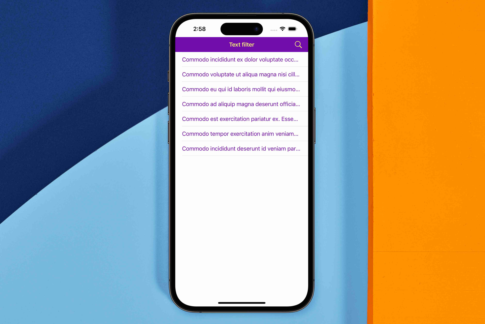

# TextFilter
Простое приложение, которое загружает текстовый файл по URL из сети Интернет, разбивает на строки, отбирает удовлетворяющие фильтру, и отображает их в виде списка.

## Принцип отбора строк
Отбор строк осуществляется по условиям простейшего **regexp**:
- cимвол "*" - последовательность любых символов неограниченной длины;
- cимвол "?" - один любой символ.

## Использование
Для теста предусмотрены 4 файла на ресурсе автора:
- **500 строк**: [https://ledkov.org/texts/test_task_500.txt](https://ledkov.org/texts/test_task_500.txt)
- **5000 строк**: [https://ledkov.org/texts/test_task_5000.txt](https://ledkov.org/texts/test_task_5000.txt)
- **15000 строк**: [https://ledkov.org/texts/test_task_15000.txt](https://ledkov.org/texts/test_task_15000.txt)
- **30000 строк**: [https://ledkov.org/texts/test_task_30000.txt](https://ledkov.org/texts/test_task_30000.txt)

## Экран списка задач

## Технические особенности
- Минимальная версия: **iOS 9.0**;
- Архитектура: стандартная **MVC**;
- Без использования сторонних зависимостей;
- Верстка кодом: **NSLayoutConstraint**;
- **Unit** тестирование;
- Документация;
- Локализация (En, Ru).